# ShopsServicesProximity_Mobile_Provider

## Abstract

The arrival of the COVID-19 pandemic has completely transformed the way the market works. Consumers who buy in-store quickly transform into online shoppers. However, local product and service providers do not have the means to benefit from this transformation, and they do not have a permanent connection with consumers.The goal of our project is to create a mobile app for local businesses and digital services. The goal is to adapt the operation of local stores and services to aconsumer that is becoming more connected, dynamic, and demanding. Thus, it would be possible for local shops and services to compete with the online shops of large groups. This requires offering these businesses and services the same capabilities and tools as online businesses and services. These tools relate to the ability to offer productsand services through a local digital marketplace. Traders, local service providers, and residents of a neighborhood (or city) must be able to use the digital space's services.

## About
This app is for local trader.
  this repository is part of two other repositories [client app](https://github.com/Abouelyatim/ShopsServicesProximity_Mobile_Client) and [backend](https://github.com/Abouelyatim/ShopsServicesProximity_Backend).

## Main features
* Store policy management.
* Store management.
* Product management.
* Offers management.
* Orders management.
* Account management.

## Architecture

## Start event
  
  
## Component 

## Dependency diagram

### app package
  

### api package
 

### repository package
 

### fragments package
 

### ui package
 

## Screens

| Orders page  | Search order   | Filter orders  | Product category  
|---|---|---|---|
|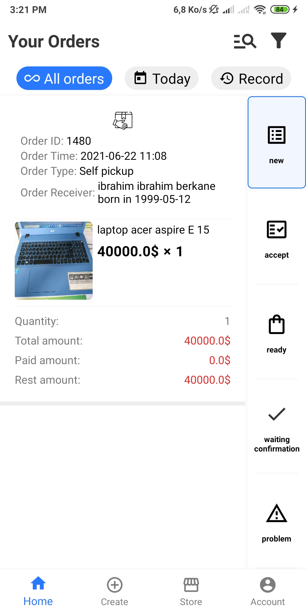   |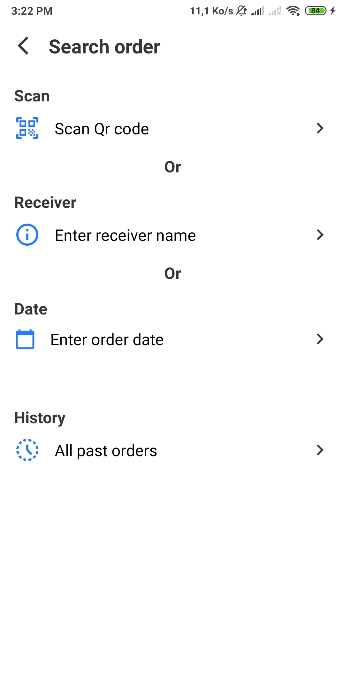     |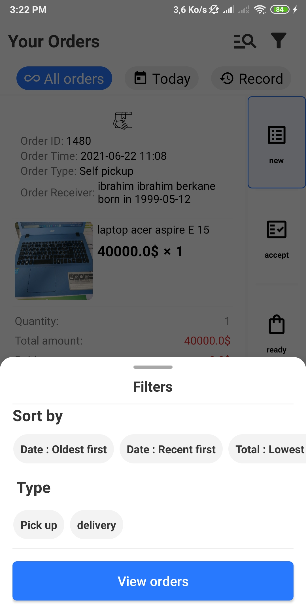    |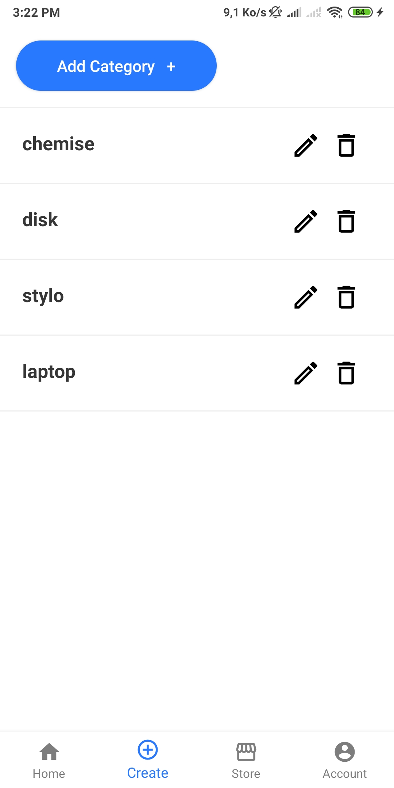

| Products inside category  | Product   | Edit product  | Store  
|---|---|---|---|
|   |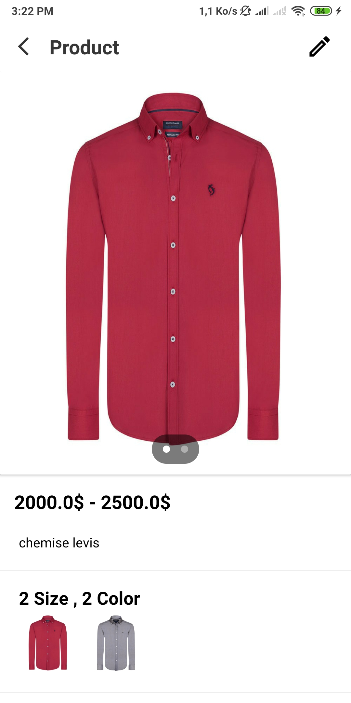     |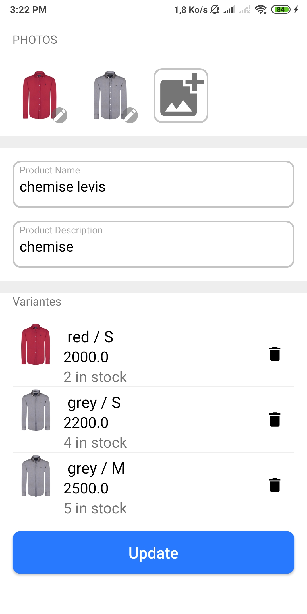    |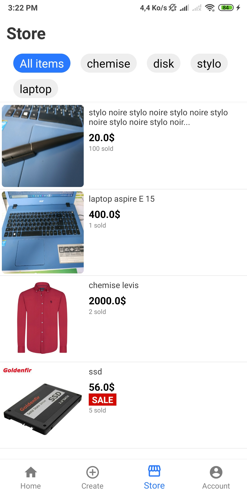

| Account  | Account informations   | Notifications settings  | Store policy  
|---|---|---|---|
|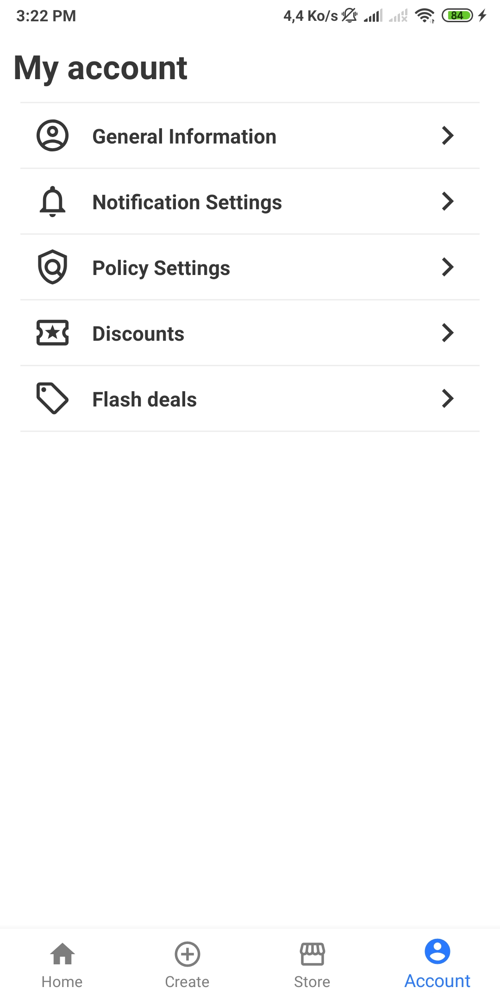   |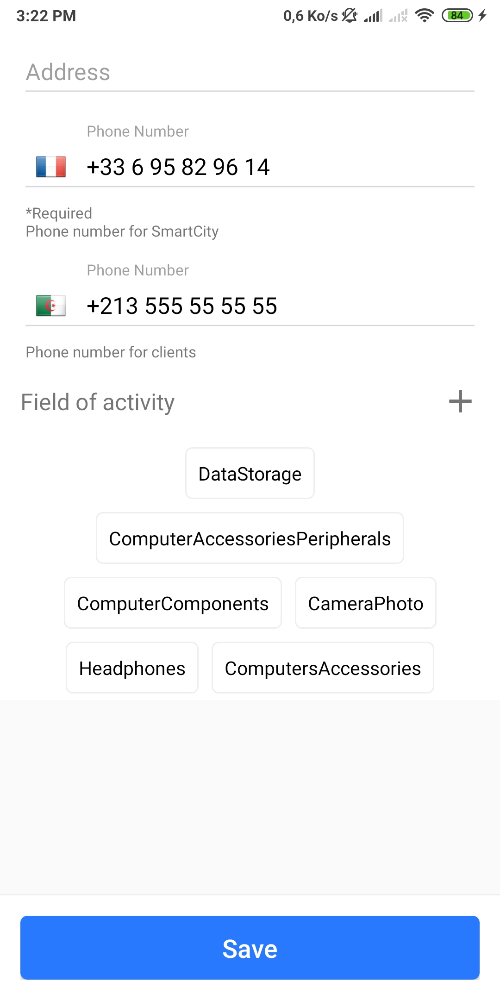     |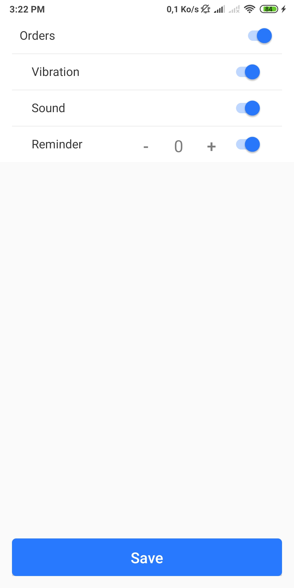    |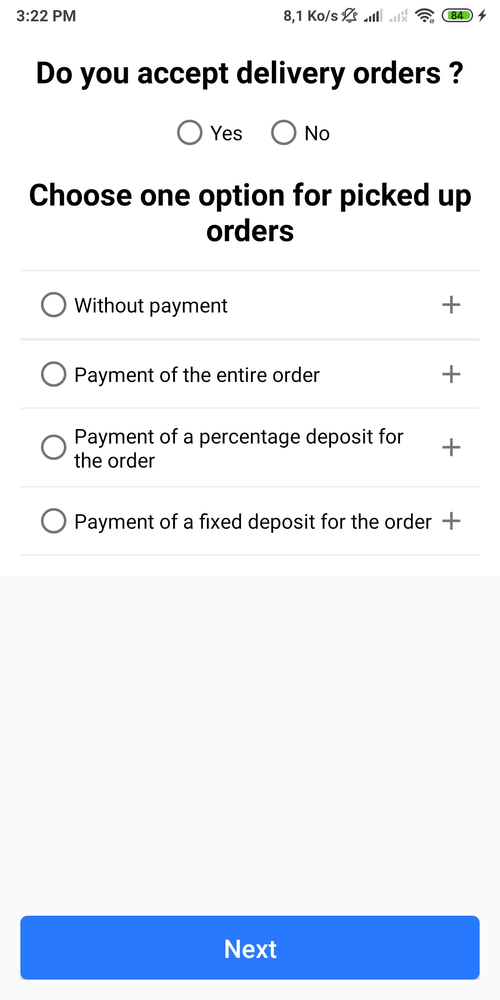

| Discounts  | Create discount   | Flash offers  | Search flash offers  
|---|---|---|---|
|   |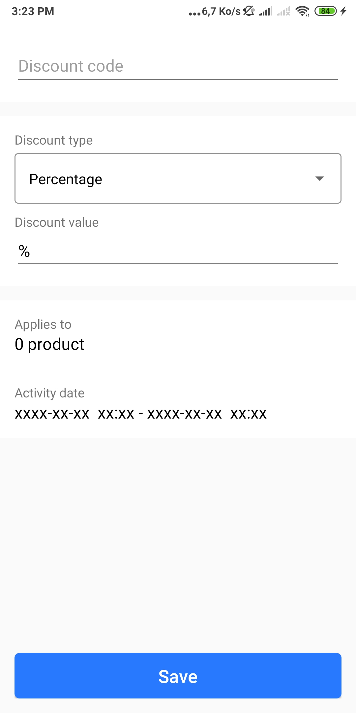     |    |

## Used technologies

|   |   |   |   |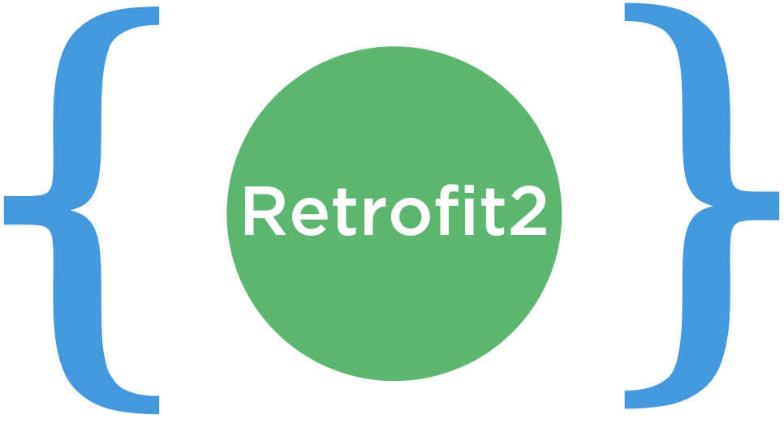   |   |
|---|---|---|---|---|---|
|   |   |   |   |   |   |

